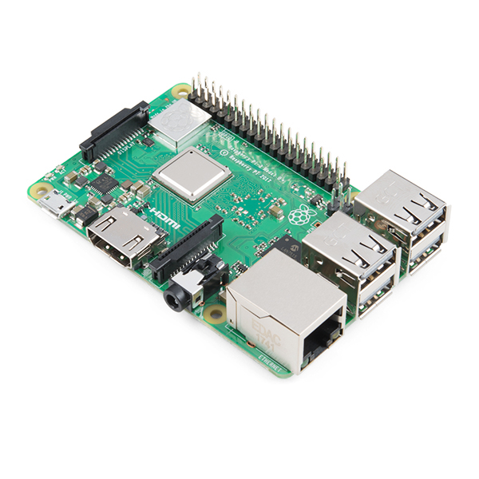

# pi-projects

Repo collection for my selected work involving the wonderful raspberry pi.

### Project Contents

AIY Vision Kit
> [Soon!](https://github.com/knightman/pi-projects/blob/master/aiy-visionkit/aiy-visionkit.md)

Camera
> [Motion Camera](https://github.com/knightman/pi-projects/blob/master/camera/motion-cam/motion-cam.md)

> [Timelapse Camera](https://github.com/knightman/pi-projects/blob/master/camera/timelapse-cam/timelapse-cam.md)

Pi Cluster
> [Soon!](https://github.com/knightman/pi-projects/blob/master/pi-cluster/pi-cluster.md)

Retropie
> [Pre-built Gaming Project](https://github.com/knightman/pi-projects/blob/master/retropie/retropie.md)

SenseHat
> [Advent Calendar](https://github.com/knightman/pi-projects/blob/master/sensehat/advent-cal/advent-cal.md)

> [Home Environment](https://github.com/knightman/pi-projects/blob/master/sensehat/home-env/home-env.md)

> [Pi Sees Ip Utility](https://github.com/knightman/pi-projects/blob/master/sensehat/piseesip/piseesip.md)

> [Tests](https://github.com/knightman/pi-projects/tree/master/sensehat)

### References
